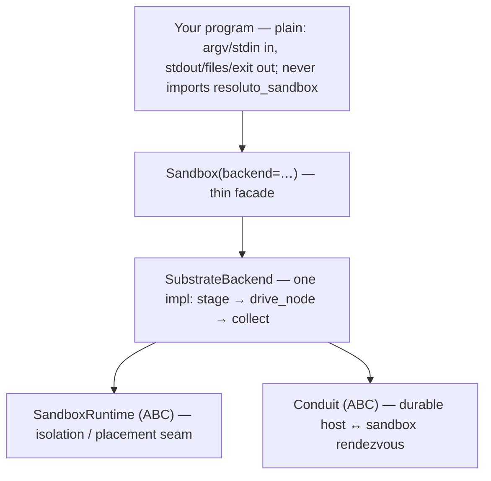
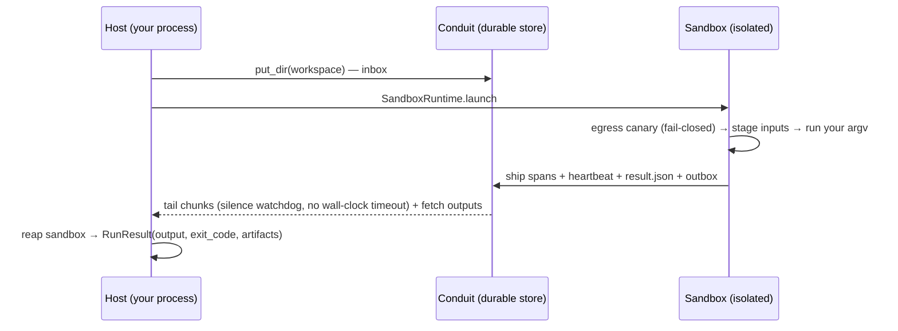

# resoluto-sandbox

Run a program in isolation and exchange data through a durable store. Your program stays plain — it
reads `argv`, writes `stdout`/files, exits, and never imports `resoluto_sandbox`. A script that runs
with `uv run agent.py` on your machine runs unchanged inside the sandbox.

<p align="left">
  
  
</p>

---

## Install

```bash
pip install resoluto-sandbox   # published wheel coming; for now: pip install -e .
```

---

## Quickstart

```python
from resoluto_sandbox import Sandbox

result = Sandbox(backend="local").run(
    ["python", "-c", "print('hello from the sandbox')"]
)
print(result.output)   # hello from the sandbox
print(result.ok)       # True
```

The result captures the output, the exit code, and any files you asked to collect (`output_paths`).
`stdin` is not supported — pass inputs via argv, env, or workspace files.

> The local backend runs in a Kata microVM and needs a lane image present in its containerd — pass
> `Sandbox(backend="local", image="…")` (default `resoluto-sandbox-base:dev`; build it from
> `Dockerfile.base`). Run argv with the **guest's** `python` and workspace-relative paths, not host
> absolute paths.

**Verify both backends end to end** with the smoke test — it runs a minimal agent through `local`
(Kata via nerdctl) and `k8s` (Kata pod) and asserts input (argv + env) → output (stdout +
`result.json`):

```bash
set -a; source store.env; source ../local.env; set +a
uv run python examples/smoke_both_backends.py        # or --local-only / --k8s-only
```

To see a **real LLM call's** input and output through the sandbox (subscription auth via
`CLAUDE_CODE_OAUTH_TOKEN`, `ANTHROPIC_API_KEY` unset):

```bash
uv run python examples/smoke_llm.py "In five words, why do sandboxes matter?"
#   INPUT  (prompt to the LLM): 'In five words, why do sandboxes matter?'
#   OUTPUT (the LLM's answer) : 'They prevent untrusted code escaping containment.'
```

---

## The program contract

A sandbox program reads `argv`, writes to `stdout` / files, exits with a code, and never imports
`resoluto_sandbox`. A script that works as `uv run agent.py` works unchanged inside the sandbox; test
runners, LLM agents, and shell scripts all qualify. Dependencies are your program's concern — put
`uv run` / `pip install` in your argv, or bake them into the image.

---

## How it works

The host and the sandbox never hold a live connection. They rendezvous through a durable key/value
store (the Conduit): the sandbox is passive — it writes append-only JSONL chunks and a final
`result.json`; the host launches it, tails the chunks, and reaps it. The same flow works whether the
sandbox is a microVM next to you or a pod in a cluster, and a network blip can't wedge a run.

```
stage → run (isolated) → collect
```

1. **Stage** — the host writes your workspace into the Conduit as an input archive.
2. **Run** — the runtime launches an isolated sandbox over the lane image. Inside it, the generic
   `runner_main` (your program never sees it) verifies egress isolation with a fail-closed canary,
   stages your inputs into `/workspace`, runs your `argv`, and streams spans, heartbeats, the result,
   and an output archive back to the Conduit. Output streams live to `stream` (default `sys.stdout`).
3. **Collect** — when the program exits, the host fetches the outputs and assembles a `RunResult`
   (output, exit code, `output_paths` artifacts, and a parsed `result.json` if your program wrote one),
   then reaps the sandbox.

Two seams carry everything; one `SubstrateBackend` drives both:

- **`SandboxRuntime`** — where and how the program is isolated (launch / status / destroy).
- **`Conduit`** — the durable host ↔ sandbox exchange (`put` / `get` / `list_prefix`).





---

## Backends

Pick by where it runs; the program, the flow, and the `RunResult` are identical. Each program runs in
a Kata microVM (separate guest kernel) in both. What differs is the Conduit and how egress is enforced:

| backend | where it runs | Conduit | egress isolation | needs |
|---------|---------------|---------|------------------|-------|
| `local` | a single host (microVM via `nerdctl` on a dedicated containerd) | bind-mounted `LocalConduit` | host-side firewall on the lane bridge | `scripts/local-backend-up.sh` (Kata + nerdctl + a dedicated containerd) |
| `k8s`   | a Kubernetes cluster (microVM pod) | object store (`S3Conduit`, minio/S3) | default-deny `NetworkPolicy` | a cluster with Kata + an S3 store + a pinned kube context |

For the `local` backend, run `scripts/local-backend-up.sh` until its canary is GREEN. For `k8s`,
inject a configured `SubstrateBackend` (or use `Sandbox(backend="k8s", image=…)`). Full setup —
including the vendor-neutral k8s stack — is in [`docs/backends.md`](docs/backends.md).

### Egress — DENY by default (secure)

A sandbox for untrusted code is **locked down by default**: a fresh lane can reach **only DNS and its
object store** — no internet, no LLM, no registries. It cannot phone home. You **opt in** to exactly
what the workload needs, with one backend-neutral `EgressConfig` — the **same knobs on `local` and
`k8s`**, with friendly presets for the common APIs:

```python
from resoluto_sandbox.egress import EgressConfig

EgressConfig(allow=["anthropic", "npm", "pypi"])   # least privilege: just the LLM + these registries
EgressConfig(allow=["github.com"], allow_port=22)  # + git over SSH
EgressConfig(public_https=True)                    # escape hatch: allow ALL outbound HTTPS (trusted code)
```

Presets (expand to the provider's API hosts): LLM APIs `anthropic openai openrouter gemini groq mistral
cohere deepseek together perplexity fireworks xai` (bundle `llms`) and registries `npm pypi uv composer
cargo go rubygems github huggingface` (bundle `registries`). On the `local` backend egress is set when
you provision, e.g. `RESOLUTO_EGRESS_ALLOW=anthropic,npm scripts/local-backend-up.sh`; on `k8s` pass the
`EgressConfig` to the runtime. IMDS is always blocked.

**Allow by DOMAIN, not IP (scales) — the SNI proxy.** `allow=[...]` resolves hostnames to CIDRs, which
goes stale for CDN-backed APIs (rotating IPs) and can't match a URL path. For a domain allowlist that
scales, route lane `:443` through the built-in **SNI egress proxy**: it reads the TLS SNI and forwards
only matching domains (exact or `*.wildcard`), no IP pinning, no CA/MITM. On `local`, opt in at
provision time:

```bash
RESOLUTO_EGRESS_DOMAINS="api.anthropic.com,*.openai.com,registry.npmjs.org" scripts/local-backend-up.sh
# lane :443 now reaches ONLY those domains. Verified end-to-end:
#   allow=api.anthropic.com    → a real Claude agent answers; registry.npmjs.org is BLOCKED
#   allow=registry.npmjs.org   → `pnpm add is-odd` installs from the registry; anything else BLOCKED
```

…or via env, honored by both backends (`local` reads them in `scripts/local-backend-up.sh`, `k8s` via
`EgressConfig.from_store_env()`):

```bash
RESOLUTO_EGRESS_ALLOW="github.com,10.1.2.3/32"   RESOLUTO_EGRESS_ALLOW_PORT=22   RESOLUTO_EGRESS_PUBLIC_HTTPS=0
```

`allow` takes hostnames **or** CIDRs (hostnames are resolved); IMDS is always blocked. Details in
[`docs/networking.md`](docs/networking.md).

---

## `Sandbox.run()` reference

```python
Sandbox(backend="local").run(
    argv,                 # program + arguments
    *,
    workspace=None,       # working directory staged into the sandbox (default: cwd)
    stdin=None,           # unsupported — raises NotImplementedError
    env=None,             # dict overlaid on the sandbox environment
    output_paths=None,    # glob patterns collected back as artifacts
    stream=None,          # live output sink; None echoes to sys.stdout
) -> RunResult
```

`RunResult`: `exit_code`, `output`, `errors` (always empty — stdout/stderr are merged), `artifacts`,
`result` (parsed `result.json` if the program wrote one), `ok` (`exit_code == 0`).

---

## CLI

```bash
resoluto-sandbox run -- echo hi                          # local backend (default)
resoluto-sandbox run --backend k8s --image  -- python agent.py
resoluto-sandbox doctor                                  # check backend readiness
```

`--` separates sandbox options from the program argv.

---

## Status

| Feature | Status |
|---|---|
| `backend="local"` — Kata microVM via nerdctl + a dedicated containerd, host-side egress | **works today** (run `scripts/local-backend-up.sh`) |
| `backend="k8s"` — Kata microVM pod + object-store Conduit + NetworkPolicy egress | **works today** — needs a Kata cluster + store + kube context |
| `Conduit` + `LocalConduit`, `StdoutConduit`, `S3Conduit` (minio/S3) | **works today** |
| `GcsConduit` | **provided, unverified** — experimental |
| Language-neutral wire spec | **published** — see `spec/PROTOCOL.md` |
| Prebuilt image matrix + `image build` CLI | design / roadmap |

---

## Further reading

- `docs/concepts.md` — the program contract, the run lifecycle, the Conduit
- `docs/backends.md` — backend setup + the vendor-neutral k8s stack install
- `docs/networking.md` — egress isolation (the canary + per-backend enforcement)
- `docs/auth.md` — Claude Max/Pro subscription auth (no API key needed)
- `spec/PROTOCOL.md` — the language-neutral host ↔ sandbox wire protocol
- `examples/` — `01_local_hello.py` (no sandbox) → `02_run_via_sandbox.py` (same program, sandboxed)
  → `claude_agent.py` (a plain Claude agent)
