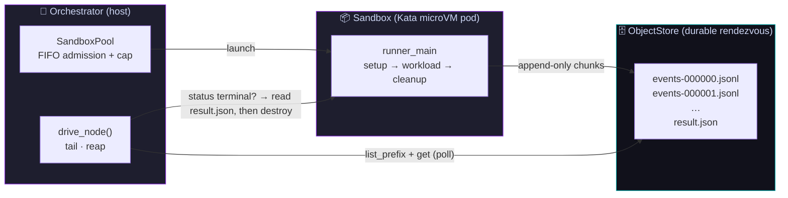
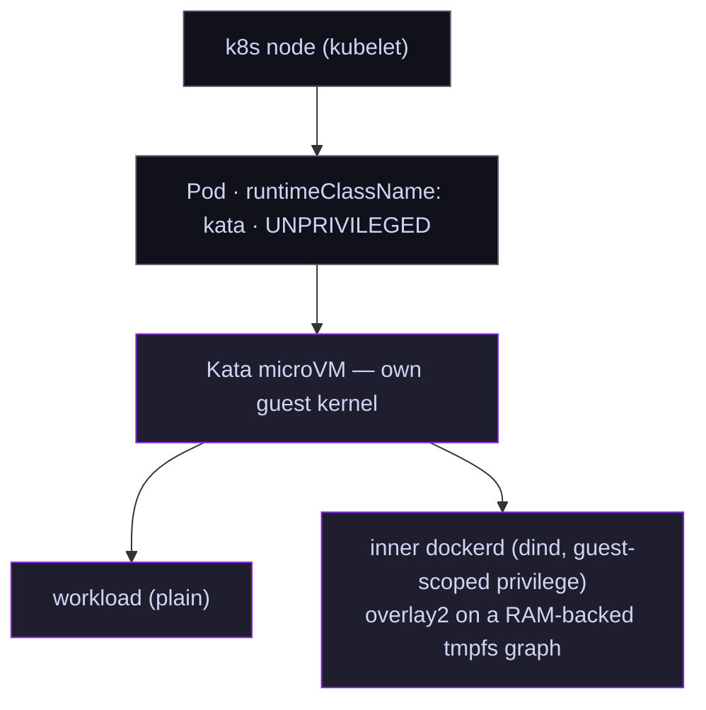

# resoluto-sandbox

> **A store-mediated, Kata-isolated, cloud-agnostic substrate for running untrusted workloads — where the orchestrator and the sandbox _never hold a connection_.**

<p align="left">
  
  
  
  
</p>

`resoluto-sandbox` launches a **passive** sandbox — it opens no inbound port and keeps no long-lived
stream. The sandbox writes append-only, immutable JSONL chunk objects into a durable object store;
the orchestrator launches it, **tails the store**, and reaps it. Inputs (a worktree tar, the spec,
credentials) and outputs (telemetry, the result) flow only as store objects.

That single design decision — *no connection between the two halves* — is what makes the substrate
robust: **there is no stream to wedge, no socket to hang, no daemon to lose.** A crashed orchestrator
re-lists the store and resumes; a silently-dead sandbox is detected by the *absence* of new chunks.

---

## Why it exists

Connection-oriented sandboxes (an in-guest agent server, a held `exec` stream, a websocket) share one
failure mode: **the control channel can wedge.** Under load — a serialization spike, a memory stall, a
nested-virtualization hiccup — the stream goes quiet while neither side can prove the other is alive.
You then either kill healthy work (false-positive reap) or wait forever (hung lane). We lived this; it
sank our previous substrate.

`resoluto-sandbox` removes the channel entirely. Liveness is redefined as **monotonic chunk arrival**:
work is alive exactly as long as new chunks keep landing in the store. A lane that goes silent past a
bounded *death window* is declared dead and reconstructed from host-side forensics — never guessed at
over a frozen socket.

---

## Features

| | |
|---|---|
| 🛰️ **Passive, store-mediated comms** | No inbound port, no held stream. The sandbox self-reports JSONL to an object store; the host tails it. Crash-durable and replayable on **both** ends. |
| 🔒 **Hardware-VM isolation (Kata)** | Each sandbox is a throwaway microVM via the k8s `kata` `runtimeClass`. A kernel/runc escape lands in a disposable guest kernel — never the host. The host pod stays **unprivileged**. |
| ☁️ **Cloud-agnostic by construction** | The whole system hangs off three small interfaces. Porting to a new platform is **two adapters** — a `SandboxRuntime` and an `ObjectStore` — nothing else. |
| 💓 **Liveness = chunk arrival** | A silently-dead substrate (the guest can't report its own death) is **time-bounded** by a death window and captured with host-side forensics. No false-positive reaps of healthy work. |
| 🌲 **Span-tree telemetry** | Every run is a tree of `SpanEvent`s (run → node → setup/workload/cleanup), redacted on egress. The same wire drives live UI, replay, and post-mortem forensics. |
| 🧱 **dind that actually works on Kata** | A hard-won `overlay2`-on-tmpfs graph makes Docker-in-Docker reliable inside a Kata guest (where the obvious drivers all dead-end — see [Storage on Kata](#storage-on-kata-read-before-touching-the-dind-path)). |
| ⚖️ **Orchestrator-side verdicts** | The in-guest exit code is **work product, not a trust decision.** A fully-compromised guest cannot forge a result; the authoritative verdict is derived outside the guest. |
| 🪝 **Step lifecycle hooks** | Injectable, observable `setup` / `cleanup` hooks — the place to free temp/RAM between gates (`docker builder prune`, `compose down -v`). |

---

## Architecture

Three small contracts (`contracts.py`) are the entire surface area:

| Interface | Role | Implementations |
|-----------|------|-----------------|
| `SandboxRuntime` | the ONE platform-specific surface — `launch` / `status` / `destroy` / `sweep` / `logs` | `K8sSandboxRuntime` (Kata via k8s `runtimeClassName`) |
| `ObjectStore`    | the durable rendezvous — `put` / `get` / `list_prefix` | `LocalFsObjectStore`, `S3ObjectStore` (minio / any S3), `GcsObjectStore` |
| `SandboxPool`    | platform-independent FIFO admission + a concurrency cap | `SandboxPool` |



**The isolation stack** — privilege is inverted relative to a privileged-DinD design: the host pod is
unprivileged; any escalation a `dind` lane needs is *guest-scoped* by Kata.



---

## How a lane runs

```
host (orchestrator)                         object store            sandbox (Kata pod)
─────────────────────                       ────────────            ──────────────────
pool.acquire(spec) ───────── launch ───────────────────────────────▶ runner_main
drive_node():                                                          run_node_in_sandbox:
  ChunkReader.poll() ◀──── events-000000.jsonl ◀──── ChunkShipper ──── setup → workload → cleanup
  forward SpanEvents                                  (append-only)     (each step = a span)
  runtime.status() ─ terminal? ─▶ read result.json ◀── result.json ─── write result
  lease.release() ──────────── destroy ──────────────────────────────▶ (pod reaped)
```

- **Liveness** is monotonic chunk arrival. Silence past the death window ⇒ a `substrate dead` failure
  with host-side forensics attached.
- **Verdict** is derived orchestrator-side — the in-guest exit code in `result.json` is work product,
  not a trust decision.
- **Telemetry** is a span tree (`run → node → setup/workload/cleanup`) via `SpanEvent`, redacted on egress.

---

## Quickstart

### Install

```bash
uv pip install -e ".[k8s,s3]"
# extras: [k8s] kubernetes-asyncio · [s3] aioboto3 · [gcs] gcloud-aio-storage
```

The package's top-level surface is **platform-independent** (pydantic only). Concrete runtimes and
stores import their heavy deps lazily, so you pull in only what you use.

### Host side — launch, tail, reap

```python
from resoluto_sandbox import SandboxLaunchSpec, SandboxPool, drive_node
from resoluto_sandbox.runtime.k8s import K8sSandboxRuntime
from resoluto_sandbox.objectstore.s3 import S3ObjectStore

runtime = K8sSandboxRuntime(namespace="resoluto-sandboxes", context="default")
pool = SandboxPool(runtime, max_concurrent=4)
store = S3ObjectStore("lanes", endpoint_url="http://minio:9000",
                      aws_access_key_id="…", aws_secret_access_key="…")

spec = SandboxLaunchSpec(
    image="your-lane-image:dev",
    flavor="plain",                 # or "dind" for docker-compose workloads
    runtime_class="kata",
    cpu="2", memory="4Gi",
    store_prefix="run/<run_id>/nodes/<node_id>",   # where the sandbox self-reports
    args=["python", "-m", "resoluto_sandbox.runner_main"],
    env={
        "RESOLUTO_STORE_KIND": "s3",
        "RESOLUTO_STORE_BUCKET": "lanes",
        "RESOLUTO_STORE_ENDPOINT": "http://minio:9000",
        "RESOLUTO_STORE_PREFIX": "run/<run_id>/nodes/<node_id>",
        "RESOLUTO_RUN_ID": "<run_id>",
        "RESOLUTO_NODE_ID": "<node_id>",
        "RESOLUTO_WORKLOAD_ARGV": '["bash","-lc","pytest -q"]',
        # AWS_* / scoped store creds injected here too
    },
    labels={"resoluto.node_id": "<node_id>"},
)

result = await drive_node(pool, store, spec, on_event=print)
print(result.status, result.reason)     # "success" | "failure"
```

`drive_node(pool, store, spec, *, on_event=None, poll_interval_s=2.0, dead_after_s=120.0)` returns a
typed [`NodeResult`](#noderesult): `status`, `exit_code`, `output_archive`, `observed_phase`,
`reason`, and `substrate_logs` (populated from out-of-guest signals when the substrate dies silently).

### Sandbox side — the passive runner

The image's entrypoint is `python -m resoluto_sandbox.runner_main`, **configured entirely from env.**
It opens no port; it learns where to self-report from the env the runtime injected, runs the workload,
and ships chunks + a `result.json` to the store:

| Env var | Meaning |
|---|---|
| `RESOLUTO_STORE_KIND` | `localfs` \| `s3` \| `gcs` |
| `RESOLUTO_STORE_ROOT` / `RESOLUTO_STORE_BUCKET` (+ `…_ENDPOINT`, `…_REGION`) | store location |
| `RESOLUTO_STORE_PREFIX` | the per-node prefix to write under |
| `RESOLUTO_RUN_ID` / `RESOLUTO_NODE_ID` | identity stamped on every span |
| `RESOLUTO_WORKLOAD_ARGV` | JSON argv of the actual work |
| `RESOLUTO_WORKSPACE_DIR` | cwd for the workload (optional) |
| `RESOLUTO_OUTPUT_PATHS` | JSON list of paths to collect back as an output archive (optional) |
| `RESOLUTO_SETUP_ARGV` / `RESOLUTO_CLEANUP_ARGV` | JSON argv for the lifecycle hooks (optional) |

> **Bring your own image.** `resoluto-sandbox` is the *runtime contract*, not an image. Any container
> that has Python + this package on `PYTHONPATH` and runs `runner_main` as its entrypoint is a valid
> sandbox. For `dind` workloads the image must ship Docker + the storage setup below.

### Step lifecycle hooks

`run_node_in_sandbox` exposes injectable, observable hooks:

- `setup_argv` — runs **before** the workload; a non-zero exit fails the node.
- `cleanup_argv` — runs **after** the workload, **always** (success, failure, or staging error),
  best-effort. The place to free temp/RAM between gates, e.g. `docker builder prune -f`,
  `docker compose down -v`.

---

## Object store backends

| Backend | Class | Use |
|---|---|---|
| Local filesystem | `LocalFsObjectStore` | dev, single-box, tests — zero infra |
| S3 / MinIO | `S3ObjectStore` | production rendezvous on any S3-compatible store |
| Google Cloud Storage | `GcsObjectStore` | GCP deployments |

Chunks are **immutable** append-only objects, so the store needs no append semantics — the reader tails
via `list_prefix` + whole-object `get`. Any blob store with list + read-after-write can be a backend; a
new one is a single `ObjectStore` subclass.

---

## Storage on Kata (read before touching the `dind` path)

The Kata guest's `/var/lib/docker` sits on **virtiofs (FUSE)**. For `dind` lanes the inner dockerd
**must** use kernel **`overlay2` on a RAM-backed tmpfs graph** — `K8sSandboxRuntime` mounts the graph
as `emptyDir{medium: Memory, sizeLimit: spec.docker_graph_size}`, and the image sets
`{"storage-driver":"overlay2"}`.

The obvious alternatives are **proven dead ends** on a real multi-image build:

| Driver | Failure on the Kata virtiofs guest |
|--------|------------------------------------|
| `vfs` | copies every layer's files → exhausts **virtiofsd's host-side** file handles → `too many open files` *while the guest uses <40 fds* (a misleading errno) |
| `overlay2` directly on virtiofs | `failed to mount overlay: invalid argument` — unsupported |
| `fuse-overlayfs` | initializes, then **deadlocks the guest** (D-state on FUSE) |

`tmpfs` is the only non-virtiofs filesystem available in the guest today, and tmpfs is RAM — so a
`dind` lane's graph counts against pod memory and the image bytes must fit. Only `dind` lanes pay this;
pure-compute lanes use no Docker. A block-backed (virtio-blk) graph to lift the RAM ceiling is on the
[roadmap](#roadmap).

---

## Liveness & verdicts

- **Only substrate-silence kills.** A lane that is quiet but still shipping chunks (e.g. a long, output-
  silent compose build) is never reaped; absence of *any* new chunk past `dead_after_s` is the kill
  signal. Healthy-but-quiet work is safe.
- **Silent death is reconstructed, not guessed.** When a terminal pod has no/garbled `result.json`, the
  driver returns a `failure` `NodeResult` carrying `observed_phase` and the tail of `runtime.logs()` —
  enough to tell an OOM run-up from a scheduling failure.
- **The guest is not trusted on read.** `result.json` and pod logs are forensic; the authoritative
  verdict is derived from out-of-guest signals. A compromised guest cannot forge a pass.

#### `NodeResult`

```python
node_id: str
status: Literal["success", "failure"]
exit_code: int | None
output_archive: str | None     # key of the collected outputs tar, if any
observed_phase: str            # filled by the orchestrator from runtime.status()
reason: str                    # human-readable failure cause
substrate_logs: str            # host-side forensics on silent death
```

---

## Security model

What the substrate gives you **today**, honestly scoped:

- ✅ **Per-lane hardware-VM isolation.** Kata `runtimeClass`; the host pod is unprivileged; `dind`
  privilege is guest-scoped (`privileged_without_host_devices`). A guest escape stays in a throwaway VM.
- ✅ **Zero inbound attack surface.** The sandbox listens on nothing; all comms are the sandbox writing
  to a store it was handed write access to. There is no host docker socket, no control daemon.
- ✅ **Untrusted-by-default verdicts.** In-guest output never decides the outcome (§ orchestrator-side
  verdict above).
- ✅ **Telemetry redaction on egress.** `redact.py` scrubs known secret shapes from spans before any
  chunk is written. (Treat it as belt-and-suspenders, not a primary control.)

> **Shipped egress controls** — `K8sSandboxRuntime` now pairs every lane pod with a declarative k8s
> NetworkPolicy when an `EgressConfig` is supplied. The policy enforces default-deny egress and allows
> only the configured CIDRs (object store, LLM provider, git hosts) on TCP/443 plus kube-dns on UDP/53.
> Every `ipBlock` rule includes `except: ["169.254.169.254/32"]` to block the cloud metadata endpoint
> (IMDS) regardless of the allowed CIDR range. The NetworkPolicy is owner-referenced to the pod so it
> is garbage-collected automatically on pod deletion.
>
> **Operational requirements for enforcement:**
> - **Enforcing CNI required** — the cluster must run Calico, Cilium, or another CNI that enforces
>   `NetworkPolicy`. Plain Flannel silently accepts the policy object but never enforces it; a Flannel
>   cluster provides no egress isolation even when `EgressConfig` is set.
> - **IMDSv2 hop-limit = 1 recommended** — set `HttpPutResponseHopLimit=1` on all nodes as a
>   belt-and-suspenders control. The `except` block in the NetworkPolicy is the primary guard; the
>   hop-limit prevents escalation if a CNI misconfiguration or upgrade gap temporarily opens IMDS.
> - **Minimal node service account recommended** — bind the node's SA to the minimum IAM policy
>   needed for kubelet operation. Even with IMDS blocked, defense-in-depth limits blast radius if the
>   node credential is reached through another path.
> - **EgressConfig fields must be CIDRs** — k8s NetworkPolicy `ipBlock` does not support FQDNs.
>   The caller resolves hostnames to IPs and passes CIDR strings (e.g. `"1.2.3.4/32"`) to
>   `EgressConfig`. Passing a bare hostname raises `ValueError` at construction time.
>
> **Remaining gap:** `SandboxLaunchSpec.store_write_token` is plumbed but the guest currently
> receives the broad store credential. A short-lived, write-only token scoped to the run's own prefix
> (so one lane can't read or overwrite another's objects) is on the roadmap.

---

## Testing

```bash
uv run pytest                    # unit tests (integration deselected by default)
uv run pytest -m integration     # live: needs k3s + Kata runtimeClass + a MinIO
```

Integration tests assume a dev cluster: k3s, the `kata` runtimeClass, and a MinIO. The canonical
end-to-end proof is the consuming project's selftest — building and running a full compose stack and a
real test suite **inside one Kata sandbox**, self-reported through MinIO.

---

## Caveats & limitations

- **`dind` lanes are RAM-bound.** Because the inner Docker graph is `overlay2`-on-tmpfs, the image bytes
  must fit in pod RAM, and an over-budget graph can OOM. Size `docker_graph_size` against real
  node-allocatable memory; a fail-loud preflight and a block-backed graph are on the roadmap.
- **Single backend, real today.** `K8sSandboxRuntime` (Kata) is the only shipped `SandboxRuntime`; the
  three-interface design makes ECS/Fly/Docker adapters straightforward, but they aren't written yet.
  "Cloud-agnostic" describes the *seam*, not multiple shipped backends.
- **Egress and scoped creds are not enforced yet** — see [Security model](#security-model).
- **Latency, not interactivity.** Store-mediated comms trade a few seconds of polling latency for
  wedge-resistance. This substrate is built for batch/lane workloads that run for minutes, not for
  sub-second interactive sessions.
- **A missing chunk stalls the tail.** The reader consumes chunks in contiguous index order; a gap
  (e.g. a shipper crash mid-sequence) blocks the tail until the death window fires. Robust, but the
  diagnostic for a gap vs. true silence is still coarse.

---

## Roadmap

- [x] Default-deny egress NetworkPolicy + IMDS drop (shipped — `EgressConfig` in `runtime/k8s.py`)
- [ ] Prefix-scoped / write-only / expiring store-credential minting + in-guest consumption
- [ ] k8s-native orphan GC (`ownerReferences` + TTL) and a deployment-wide concurrency cap
- [ ] Fail-closed admission guard (reject non-Kata `runtime_class` outside trusted-local)
- [ ] Block-backed (virtio-blk) Docker graph to lift the `dind` RAM ceiling
- [ ] Additional `SandboxRuntime` adapters (ECS / Fly / plain Docker)
- [ ] OSS-clean base image: substrate + this runner only, with the consuming stack layered on top

---

## How it differs from connection-oriented sandboxes

| | Connection-oriented (agent server / held `exec`) | **resoluto-sandbox** |
|---|---|---|
| Control channel | live socket / stream | **none** — durable object store |
| Liveness | heartbeat / healthcheck over the channel | **chunk arrival** in the store |
| Orchestrator crash | loses the session | **re-list + resume** |
| Sandbox death | hang or false-positive reap | bounded death window + forensics |
| Inbound surface | a port / daemon to attack | **zero** |
| Trust on output | often implicit | **never** — verdict is orchestrator-side |

---

## License & author

Part of the **Resoluto** project — `DeepBlueCoding/resoluto-sandbox`. See `LICENSE` in the repository.
