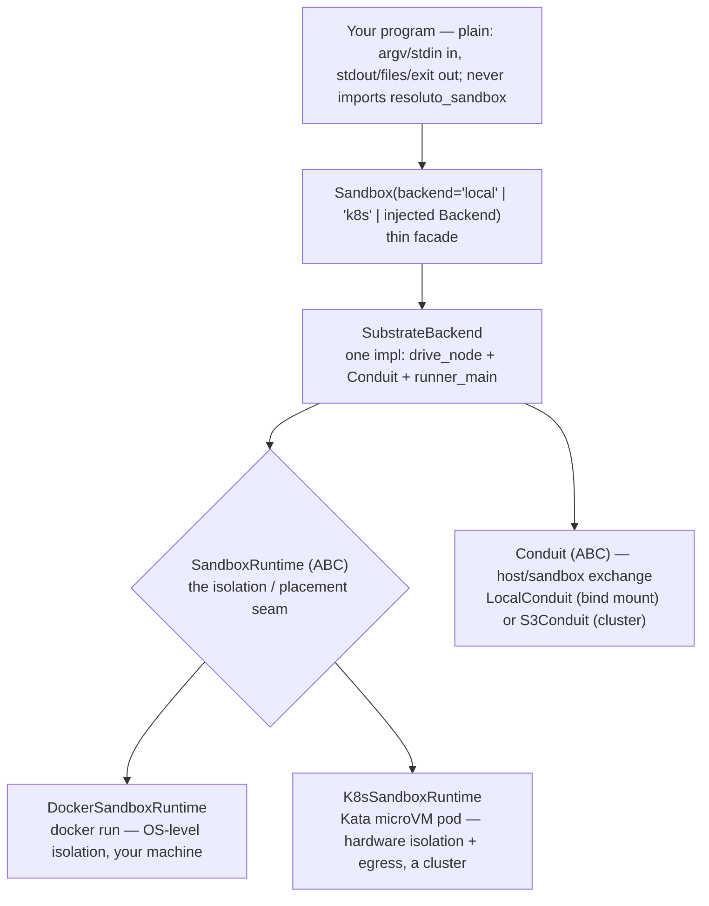
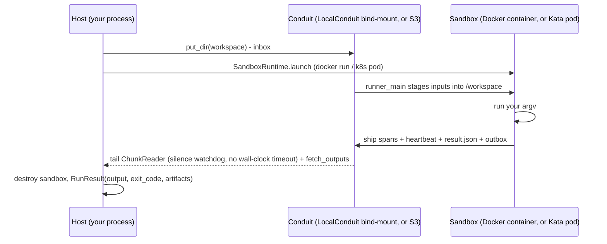

# resoluto-sandbox

Run any program or agent script in a sandbox. Your program stays plain — it imports your own SDK,
never `resoluto_sandbox`. The same script that runs with `uv run agent.py` on your machine runs
unchanged inside the sandbox; the backend changes only where it runs.

<p align="left">
  
  
</p>

---

## Install

```bash
pip install resoluto-sandbox   # published wheel coming; for now: pip install -e .
```

---

## 60-second local quickstart

Requires Docker and a runner image (default `resoluto-sandbox-runner:dev`). Run a program in an
isolated Docker container and capture its output:

```python
from resoluto_sandbox import Sandbox

result = Sandbox(backend="local").run(
    ["python", "-c", "print('hello from the sandbox')"]
)
print(result.output)   # hello from the sandbox
print(result.ok)       # True
```

`backend="local"` runs the program in a Docker container on this host (OS-level isolation: separate
PID/mount/network namespaces, cgroups). The result captures output, the exit code, and any files you
asked to collect. `stdin` is not supported on either backend — pass inputs via argv, env, or workspace
files.

---

## Run your own agent, unchanged

The sandbox enforces one contract: **your program never imports `resoluto_sandbox`**. It reads
`argv` and writes to `stdout`/files and exits. That is the whole interface.

A script that works directly also works inside the sandbox. On `backend="local"` it runs in a Docker
container with OS-level isolation; on `backend="k8s"` it runs in a Kata microVM. The program itself
is unmodified in either case:

```python
from resoluto_sandbox import Sandbox

result = Sandbox(backend="local").run(
    ["uv", "run", "examples/claude_agent.py", "Summarise the Zen of Python"]
)
print(result.output)
```

See `examples/claude_agent.py` for a minimal Claude agent and `docs/auth.md` for the
Claude Max/Pro subscription auth path (no API key needed).

---

## Architecture

ONE `SubstrateBackend` drives everything. The only thing that varies is the injected
`SandboxRuntime` (Docker locally, a Kata pod on k8s) and the `Conduit` (bind-mount locally, S3 on
k8s). The program, the result shape, and the `Sandbox` facade are identical across both.



**Run flow** (one flow for both backends; runtime + conduit differ):



---

## Backends

| backend | isolation | where it runs | needs | use for |
|---------|-----------|---------------|-------|---------|
| `local` | OS-level (Docker namespaces/cgroups) | your machine | Docker + an image | dev and most workloads, no cluster |
| `k8s` | hardware (Kata microVM) + egress policy | a Kubernetes cluster | k8s + Kata + S3 store + image | untrusted code at scale, locked-down egress, production |

For the full guide including the vendor-neutral k8s stack install (works on k3s, kind, EKS, GKE,
AKS, and any Kubernetes distribution), see [`docs/backends.md`](docs/backends.md).

---

## Dependencies

Dependencies are your program's concern — put `uv run`/`pip install` in your argv, or use a prebuilt
image. For `backend="local"`, the image must contain python + the resoluto-sandbox wheel + your
program's deps.

---

## k8s backend

Requires a Kubernetes cluster (k3s, kind, EKS, or any distribution) with Kata Containers,
`RESOLUTO_STORE_KIND` (plus the matching store env vars) set in the environment, and
`RESOLUTO_SANDBOX_KUBECONTEXT` pinned (the backend fails closed if this is unset).
Inject a configured `SubstrateBackend`:

```python
import os
from resoluto_sandbox import Sandbox
from resoluto_sandbox.backends.substrate import SubstrateBackend, store_env_for_pod
from resoluto_sandbox.conduit.factory import store_from_env
from resoluto_sandbox.runtime.k8s import K8sSandboxRuntime, EgressConfig

runtime = K8sSandboxRuntime(
    namespace="resoluto-sandboxes",
    context=os.environ.get("RESOLUTO_SANDBOX_KUBECONTEXT"),
)
sb = Sandbox(backend=SubstrateBackend(
    runtime=runtime,
    conduit=store_from_env(),
    image="<registry>/resoluto-lane:dev",
    store_env=store_env_for_pod(os.environ),
))
out = sb.run(["bash", "-lc", "echo hi"], workspace="./proj", output_paths=["*.txt"])
```

Or use the convenience preset:
```python
Sandbox(backend="k8s", image="<registry>/resoluto-lane:dev").run(...)
```

Limits: **no `stdin`** (raises `NotImplementedError` on both backends); dependencies must be baked
into the image. `RunResult.errors` is always empty; the in-sandbox runner merges stdout and stderr
into the output stream.

---

## CLI

```bash
resoluto-sandbox run -- echo hi                       # local backend (default)
resoluto-sandbox run --backend k8s --image  -- python agent.py  # k8s backend
resoluto-sandbox doctor                               # check what is available on this machine
```

`--` separates sandbox options from the program argv.

---

## `Sandbox.run()` reference

```python
Sandbox(backend="local").run(
    argv,                        # program + arguments
    *,
    workspace=None,              # working directory for the program (default: cwd)
    stdin=None,                  # NOT SUPPORTED — raises NotImplementedError on both backends
    env=None,                    # dict overlaid on the sandbox environment
    output_paths=None,           # list of glob patterns to collect as artifacts
    stream=None,                 # live output sink; None (default) echoes to sys.stdout; pass a StringIO/file to capture
) -> RunResult
```

`RunResult` fields: `exit_code`, `output`, `errors`, `artifacts`, `result` (parsed `result.json`
if the program wrote one), `ok` (property: `exit_code == 0`).

---

## Status

| Feature | Status |
|---|---|
| `backend="local"` — Docker container on host, OS-level isolation (namespaces/cgroups), live output | **works today** |
| CLI: `run` + `doctor` | **works today** |
| `Conduit` abstraction + `LocalConduit`, `StdoutConduit`, `S3Conduit` (minio/S3-compatible, proven) | **works today** |
| `GcsConduit` | **provided, unverified** — experimental; not tested end-to-end |
| Language-neutral wire spec | **published** — see `spec/PROTOCOL.md` |
| `backend="k8s"` — Kata microVM isolation via `SubstrateBackend` + `K8sSandboxRuntime` | **implemented** — requires a Kubernetes cluster (k3s, kind, EKS, …) + Kata + store env + kubecontext |
| Prebuilt image matrix (`-base`, `-runner`, langchain, openai variants) + `image build` CLI | design / roadmap |
| Worker migration utilities | design / roadmap |

---

## Further reading

- `docs/backends.md` — backends overview, local and k8s detail, vendor-neutral k8s stack install guide
- `docs/auth.md` — Claude Max/Pro subscription auth (local and container)
- `docs/networking.md` — egress isolation on the k8s backend (EgressConfig, NetworkPolicy, canary)
- `spec/PROTOCOL.md` — language-neutral host ↔ sandbox wire protocol (JSON Schemas included)
- `examples/` — runnable examples ladder:
  - `uv run examples/01_local_hello.py` — standalone program, no sandbox
  - `uv run python examples/02_run_via_sandbox.py` — same program via `Sandbox.run()`
  - `examples/claude_agent.py` — BYO Claude agent (plain script, no `resoluto_sandbox` import)
