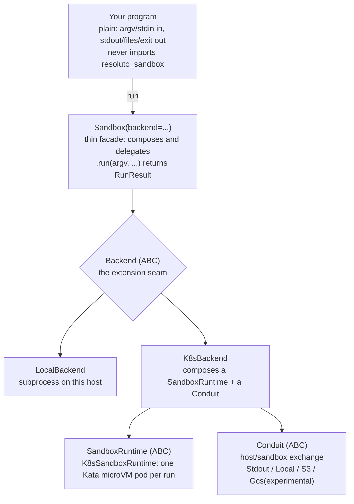
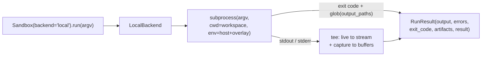
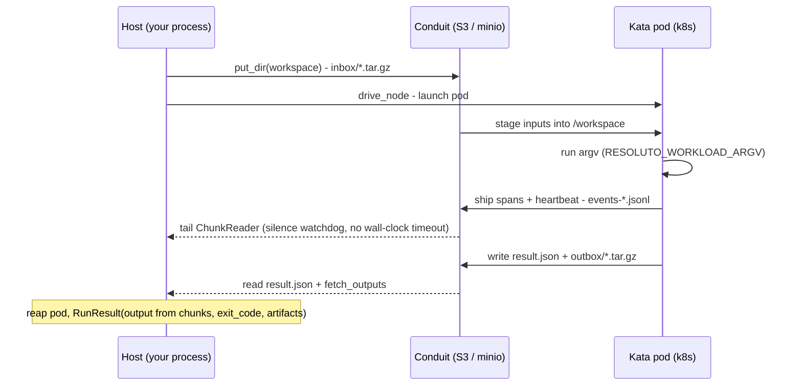

# resoluto-sandbox

Run any program or agent script in a sandbox. Your program stays plain — it imports your own SDK,
never `resoluto_sandbox`. The same script that runs with `uv run agent.py` on your machine runs
unchanged inside the sandbox.

<p align="left">
  
  
</p>

---

## Install

```bash
pip install resoluto-sandbox   # published wheel coming; for now: pip install -e .
```

---

## 60-second local quickstart

No cloud account, no Docker, no config. Run a program as a subprocess and capture its output:

```python
from resoluto_sandbox import Sandbox

result = Sandbox(backend="local").run(
    ["python", "-c", "print('hello from the sandbox')"]
)
print(result.output)   # hello from the sandbox
print(result.ok)       # True
```

`backend="local"` runs the program as a subprocess on this host. The result captures output,
errors, the exit code, and any files you asked to collect.

---

## Run your own agent, unchanged

The sandbox enforces one contract: **your program never imports `resoluto_sandbox`**. It reads
`argv`/`stdin` and writes to `stdout`/files and exits. That is the whole interface.

The same invocation that works directly also works inside the sandbox:

```bash
uv run examples/claude_agent.py "Summarise the Zen of Python"
```

```python
from resoluto_sandbox import Sandbox

result = Sandbox(backend="local").run(
    ["uv", "run", "examples/claude_agent.py", "Summarise the Zen of Python"]
)
print(result.output)
```

See `examples/claude_agent.py` for a minimal Claude agent and `docs/auth.md` for the
Claude Max/Pro subscription auth path (no API key needed).

---

## Architecture

The `Sandbox` facade is a thin delegator: it **composes** an injected `Backend` and forwards
`run()` to it. Adding a substrate means implementing the `Backend` ABC — nothing in the facade
changes.



**Local run** — a subprocess on the host; output is teed (streamed live *and* captured):



**k8s run** — a connectionless host⇄pod loop through the Conduit (object store); the pod is
passive (no inbound port), the host tails and reaps:



---

## Backends

| backend | isolation | where it runs | needs | use for |
|---------|-----------|---------------|-------|---------|
| `local` | none (host subprocess) | your host | nothing | dev, trusted code, fast iteration |
| `k8s` | hardware (Kata microVM) per run | a Kubernetes cluster | k8s + Kata + S3 store + provider image | untrusted/adversarial code, production |

For the full guide including the vendor-neutral k8s stack install (works on k3s, kind, EKS, GKE,
AKS, and any Kubernetes distribution), see [`docs/backends.md`](docs/backends.md).

---

## Dependencies

Dependencies are your program's concern — put `uv run`/`pip install` in your argv, or use a prebuilt image.

---

## k8s backend

Requires a Kubernetes cluster (k3s, kind, EKS, or any distribution) with Kata Containers,
`RESOLUTO_STORE_KIND` (plus the matching store env vars) set in the environment, and
`RESOLUTO_SANDBOX_KUBECONTEXT` pinned (the backend fails closed if this is unset).
The image is a backend concern — inject a configured `K8sBackend`:

```python
from resoluto_sandbox import Sandbox
from resoluto_sandbox.backends.k8s import K8sBackend

sb = Sandbox(backend=K8sBackend(image="<registry>/resoluto-lane:dev"))
out = sb.run(["bash", "-lc", "echo hi"], workspace="./proj", output_paths=["*.txt"])
```

Limits on `backend="k8s"`: **no `stdin`** (raises `NotImplementedError`); dependencies must be baked into the image. `RunResult.errors` is always empty on this backend; the in-pod runner merges stdout and stderr into the output stream.

`Sandbox(backend="k8s")` without an injected backend builds `K8sBackend(image=None)`, which raises
a clear `ValueError` on `run()` asking you to inject `K8sBackend(image=...)` instead.

---

## CLI

```bash
resoluto-sandbox run -- echo hi                       # local backend (default)
resoluto-sandbox run --backend k8s --image  -- python agent.py  # k8s backend
resoluto-sandbox doctor                               # check what is available on this machine
```

`--` separates sandbox options from the program argv.

---

## `Sandbox.run()` reference

```python
Sandbox(backend="local").run(
    argv,                        # program + arguments
    *,
    workspace=None,              # working directory for the program (default: cwd)
    stdin=None,                  # str or bytes fed to stdin
    env=None,                    # dict overlaid on the host environment
    output_paths=None,           # list of glob patterns to collect as artifacts
    stream=None,                 # live output sink; None (default) echoes to sys.stdout; pass a StringIO/file to capture
) -> RunResult
```

`RunResult` fields: `exit_code`, `output`, `errors`, `artifacts`, `result` (parsed `result.json`
if the program wrote one), `ok` (property: `exit_code == 0`).

---

## Status

| Feature | Status |
|---|---|
| `backend="local"` — subprocess on host, full env inheritance, live output | **works today** |
| CLI: `run` + `doctor` | **works today** |
| `Conduit` abstraction + `LocalConduit`, `StdoutConduit`, `S3Conduit` (minio/S3-compatible, proven) | **works today** |
| `GcsConduit` | **provided, unverified** — experimental; not tested end-to-end |
| Language-neutral wire spec | **published** — see `spec/PROTOCOL.md` |
| `backend="k8s"` — Kata microVM isolation via injected `K8sBackend` | **implemented** — requires a Kubernetes cluster (k3s, kind, EKS, …) + Kata + store env + kubecontext |
| Prebuilt image matrix (`-base`, `-runner`, langchain, openai variants) + `image build` CLI | design / roadmap |
| Worker migration utilities | design / roadmap |

---

## Further reading

- `docs/backends.md` — backends overview, local and k8s detail, vendor-neutral k8s stack install guide
- `docs/auth.md` — Claude Max/Pro subscription auth (local and container)
- `docs/networking.md` — egress isolation on the k8s backend (EgressConfig, NetworkPolicy, canary)
- `spec/PROTOCOL.md` — language-neutral host ↔ sandbox wire protocol (JSON Schemas included)
- `examples/` — runnable examples ladder:
  - `uv run examples/01_local_hello.py` — standalone program, no sandbox
  - `uv run python examples/02_run_via_sandbox.py` — same program via `Sandbox.run()`
  - `examples/claude_agent.py` — BYO Claude agent (plain script, no `resoluto_sandbox` import)
