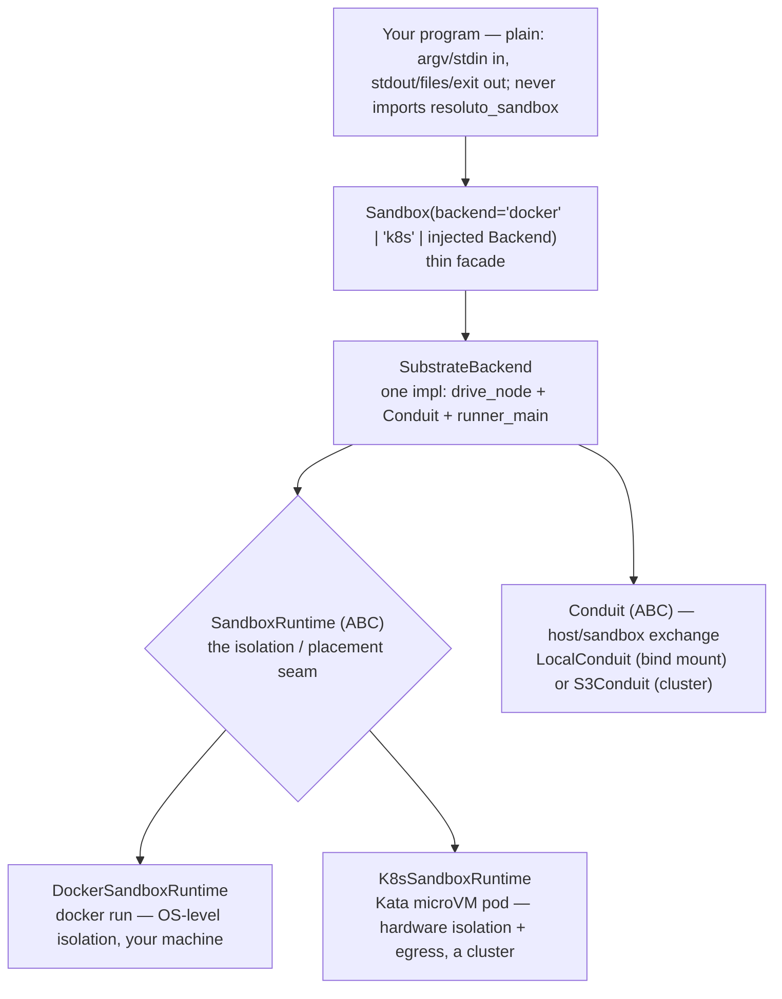
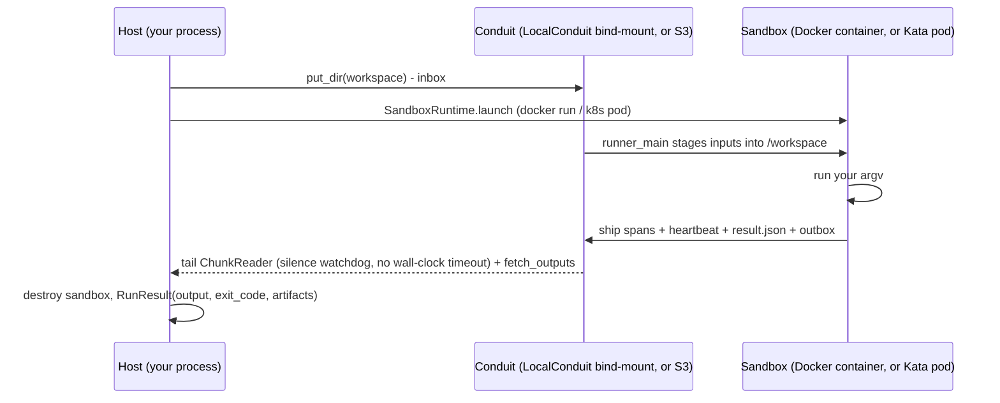

# Backends

`Sandbox` delegates every run to a pluggable `Backend`. This page covers the two
presets, how to install the k8s stack on any Kubernetes distribution, and how to
wire in a custom backend.

---

## Backends overview

| backend | isolation | where it runs | needs | use for |
|---------|-----------|---------------|-------|---------|
| `docker` | OS-level (Docker namespaces/cgroups) | your machine | Docker + an image | dev and most workloads, no cluster |
| `k8s` | hardware (Kata microVM) + egress policy | a Kubernetes cluster | k8s + Kata + S3 store + image | untrusted code at scale, locked-down egress, production |

---

## Architecture diagrams



**Run flow** (one flow for both backends; runtime + conduit differ):



---

## docker

### How it runs

`backend="docker"` runs the program in a Docker container on this host via `DockerSandboxRuntime`.
The host and container share a `LocalConduit` over a bind-mounted directory (`/conduit`). No
cluster, no S3 — everything stays on your machine:

```
Sandbox(backend="docker").run(argv, workspace, output_paths)
   └─ SubstrateBackend (DockerSandboxRuntime + LocalConduit)
        docker run --rm -v <conduit>:/conduit <image>
          runner_main stages workspace → /workspace
          runs argv
          ships spans + heartbeat to /conduit
          writes result.json + outbox to /conduit
   → RunResult(output, exit_code, artifacts)     # no k8s, no S3
```

The egress canary is skipped (`RESOLUTO_TRUSTED_LOCAL=1` is set by the docker preset), so the
docker backend is NOT egress-locked. Docker provides OS-level isolation (separate PID/mount/network
namespaces, cgroups), but NOT egress NetworkPolicy isolation — use `backend="k8s"` for
locked-down egress or hardware isolation.

### What you need

- Docker running on this machine.
- An image that contains python + the resoluto-sandbox wheel + your program's deps. Default:
  `resoluto-sandbox-runner:dev`. Override with `Sandbox(backend="docker", image="your-image:tag")`.

### When to use

- Development and iteration (no cluster needed).
- Trusted code where namespace isolation is sufficient.
- Testing your program logic before graduating to k8s.

> **The docker backend gives OS-level isolation (Docker namespaces/cgroups), NOT egress-policy isolation.**
> The egress canary is disabled. For locked-down egress or hardware isolation use `backend="k8s"`.

### `RunResult` on docker

The in-sandbox runner merges stdout and stderr as `log` span events, so `RunResult.output` carries
the merged stream and `RunResult.errors` is always `""`. This is intentional, not a dropped field.

### `stdin` on docker

`stdin` is NOT supported — `NotImplementedError` if you pass `stdin=`. Pass inputs via argv, env,
or workspace files.

---

## k8s

### How it runs

Each `run()` call launches one short-lived Kata microVM pod. The host and pod exchange
data through a `Conduit` (an S3-compatible object store); there is no long-lived
connection between them.

```
   host (your process)            Conduit  (S3 / minio / …)        Kata microVM pod (k8s)
   ───────────────────           ───────────────────────         ──────────────────────
   put_dir(workspace) ─────────────▶  inbox/ *.tar.gz ───────────▶  stage inputs -> /workspace
   drive_node: launch pod ───────────────────────────────────────▶  run argv (RESOLUTO_WORKLOAD_ARGV)
   tail ChunkReader  ◀───────────── events-000001.jsonl ◀──────────  ship spans + heartbeat (no stream)
        (silence-watchdog; NO wall-clock timeout)
   read result.json  ◀───────────── result.json ◀─────────────────  write verdict
   fetch_outputs     ◀───────────── outbox/ *.tar.gz ◀────────────  collect output_paths
   reap pod
   → RunResult(output reconstructed from chunks, exit_code, artifacts)
```

Liveness is a substrate-silence watchdog: if no chunk arrives for 600 seconds the pod
is considered dead. There is no wall-clock timeout on the work itself — a live pod runs
as long as it keeps emitting.

### Usage

The image is not a `Sandbox` concern — inject a configured `SubstrateBackend`:

```python
import os
from resoluto_sandbox import Sandbox
from resoluto_sandbox.backends.substrate import SubstrateBackend, store_env_for_pod
from resoluto_sandbox.conduit.factory import store_from_env
from resoluto_sandbox.runtime.k8s import K8sSandboxRuntime

runtime = K8sSandboxRuntime(
    namespace=os.environ.get("RESOLUTO_SANDBOX_NAMESPACE", "resoluto-sandboxes"),
    context=os.environ.get("RESOLUTO_SANDBOX_KUBECONTEXT"),
)
sb = Sandbox(backend=SubstrateBackend(
    runtime=runtime,
    conduit=store_from_env(),
    image="<registry>/resoluto-lane:dev",
    store_env=store_env_for_pod(os.environ),
))
result = sb.run(["bash", "-lc", "echo hi"], workspace="./proj", output_paths=["*.txt"])
print(result.output)   # "hi"
print(result.ok)       # True
```

Or use the convenience preset (reads `RESOLUTO_LANE_IMAGE` and `RESOLUTO_STORE_KIND` from env):

```python
Sandbox(backend="k8s", image="<registry>/resoluto-lane:dev").run(...)
```

### `RunResult` on k8s

The in-pod runner emits stdout and stderr together as `log` span events, so
`RunResult.output` carries the merged stream and `RunResult.errors` is always `""`.
This is intentional, not a dropped field.

`RunResult.reason` carries substrate forensics when a pod is evicted or OOM-killed;
it is `""` on a normal exit.

Both `output` and `errors` are populated in the same fields as the local backend —
the conduit is transport; the result shape is uniform.

### Hard limits

- **`stdin` is not supported** — `NotImplementedError` if you pass `stdin=`.
- **Dependencies must be baked into the image** — the pod has no package manager access
  at runtime. Put everything your program needs in the image.

### Optional: egress lockdown

By default, Kata provides kernel isolation but places no restriction on network egress.
For untrusted code, add `EgressConfig` to apply a default-deny `NetworkPolicy`:

```python
import os
from resoluto_sandbox import Sandbox
from resoluto_sandbox.backends.substrate import SubstrateBackend, store_env_for_pod
from resoluto_sandbox.conduit.factory import store_from_env
from resoluto_sandbox.runtime.k8s import K8sSandboxRuntime, EgressConfig

runtime = K8sSandboxRuntime(
    namespace="resoluto-sandboxes",
    context=os.environ.get("RESOLUTO_SANDBOX_KUBECONTEXT"),
    egress=EgressConfig(
        store_cidr="10.0.0.5/32",      # your S3/minio endpoint — CIDR notation only
        llm_cidr="1.2.3.4/32",         # your LLM provider endpoint
        git_cidrs=["140.82.112.0/20"], # optional; [] = no git egress
    ),
)
sb = Sandbox(backend=SubstrateBackend(
    runtime=runtime,
    conduit=store_from_env(),
    image="<registry>/resoluto-lane:dev",
    store_env=store_env_for_pod(os.environ),
))
```

All CIDRs must be in `x.x.x.x/nn` notation — `NetworkPolicy` `ipBlock` does not accept
hostnames. Resolve FQDNs to CIDRs yourself. IMDS (`169.254.169.254/32`) is always
blocked regardless of the allowlist.

See `docs/networking.md` for the full egress reference.

---

## Installing the k8s stack

The k8s backend works on **any Kubernetes distribution** — self-hosted (k3s, kind,
microk8s) or managed (EKS, GKE, AKS). Follow these steps in order.

### 1. A Kubernetes cluster

Choose any distribution:

- **Self-hosted (local/dev):** [k3s](https://k3s.io), [kind](https://kind.sigs.k8s.io),
  [minikube](https://minikube.sigs.k8s.io), [microk8s](https://microk8s.io)
- **Managed (production):** EKS (AWS), GKE (GCP), AKS (Azure)

The cluster must be reachable from your host via `kubectl`. Confirm:

```bash
kubectl cluster-info
```

### 2. Kata Containers (hardware isolation)

Install the Kata Containers runtime on each node: https://katacontainers.io/docs/

Then create a `RuntimeClass` named `kata`:

```yaml
apiVersion: node.k8s.io/v1
kind: RuntimeClass
metadata:
  name: kata
handler: kata
```

```bash
kubectl apply -f kata-runtimeclass.yaml
```

Verify:

```bash
kubectl get runtimeclass kata
```

> Some managed clusters offer Kata as an optional add-on (e.g. GKE Sandbox). Check
> your provider's documentation before installing from scratch.

### 3. A NetworkPolicy-enforcing CNI (optional)

Only needed if you plan to use `EgressConfig`. Common choices: **Calico**, **Cilium**,
or **Flannel** with the NetworkPolicy controller.

Many managed clusters (EKS with VPC CNI + Network Policy, GKE Dataplane V2, AKS with
Azure CNI) support NetworkPolicy natively — check whether it needs to be enabled first.

> Without a NetworkPolicy-capable CNI the policy manifest is applied but **silently not
> enforced**. The egress canary (run in-guest before your workload) is the empirical
> backstop that detects this.

### 4. An S3-compatible object store

The host and pods exchange data through a shared object store reachable from **both**
your host machine and the pods inside the cluster.

**Option A — minio (local/dev):**

```bash
docker run -d --name minio \
  -p 9000:9000 -p 9001:9001 \
  -e MINIO_ROOT_USER=minioadmin \
  -e MINIO_ROOT_PASSWORD=minioadmin \
  quay.io/minio/minio server /data --console-address ":9001"
```

Create a bucket named `resoluto`:

```bash
# with the mc CLI (https://min.io/docs/minio/linux/reference/minio-mc.html):
mc alias set local http://localhost:9000 minioadmin minioadmin
mc mb local/resoluto
```

> The endpoint must be a routable address the pods can reach. `localhost` from the host
> is NOT reachable inside pods — use the host's LAN IP or a cluster-internal service address.

**Option B — cloud S3:**

Create a bucket on AWS S3 (or any S3-compatible provider). Set the bucket policy to
allow the credentials you will export below.

### 5. Build and push a provider image

Build the image and push it to a registry the cluster can pull from:

```bash
resoluto-sandbox image build --provider claude --context ..
docker push <registry>/resoluto-lane:dev
```

Set the image in the environment:

```bash
export RESOLUTO_LANE_IMAGE=<registry>/resoluto-lane:dev
```

### 6. Export environment variables

```bash
# Pin the kube context (required — backend refuses to launch without this)
export RESOLUTO_SANDBOX_KUBECONTEXT=<your-context-name>

# Namespace for sandbox pods (default: resoluto-sandboxes)
export RESOLUTO_SANDBOX_NAMESPACE=resoluto-sandboxes

# Image to run inside each pod
export RESOLUTO_LANE_IMAGE=<registry>/resoluto-lane:dev

# Conduit: S3-compatible store
export RESOLUTO_STORE_KIND=s3
export RESOLUTO_STORE_ENDPOINT=http://<minio-host>:9000   # omit for AWS S3
export RESOLUTO_STORE_BUCKET=resoluto
export RESOLUTO_STORE_REGION=us-east-1

# Store credentials — use a scoped token (preferred) or ambient AWS creds:
export AWS_ACCESS_KEY_ID=<your-key-id>
export AWS_SECRET_ACCESS_KEY=<your-secret>
```

Replace all `<placeholders>` with your real values. Do not commit secrets.

`RESOLUTO_SANDBOX_KUBECONTEXT` is required — the backend fails closed if it is unset
(to prevent accidentally targeting the wrong cluster). Use
`RESOLUTO_SANDBOX_ALLOW_AMBIENT_CONTEXT=1` only in carefully controlled environments.

### 7. Smoke test

```python
import os
from resoluto_sandbox import Sandbox
from resoluto_sandbox.backends.substrate import SubstrateBackend, store_env_for_pod
from resoluto_sandbox.conduit.factory import store_from_env
from resoluto_sandbox.runtime.k8s import K8sSandboxRuntime

runtime = K8sSandboxRuntime(
    namespace="resoluto-sandboxes",
    context=os.environ.get("RESOLUTO_SANDBOX_KUBECONTEXT"),
)
sb = Sandbox(backend=SubstrateBackend(
    runtime=runtime,
    conduit=store_from_env(),
    image=os.environ["RESOLUTO_LANE_IMAGE"],
    store_env=store_env_for_pod(os.environ),
))
result = sb.run(["bash", "-lc", "echo hi from kata"])
print(result.output)   # "hi from kata"
assert result.ok
```

If the run hangs, check that the pod can reach the store endpoint (`kubectl logs -n
resoluto-sandboxes <pod-name>`) and that `RESOLUTO_SANDBOX_KUBECONTEXT` points at the
right cluster.

---

## Adding another backend

To add a new isolation target, implement `SandboxRuntime` (the isolation/placement seam)
and wire it into `SubstrateBackend`:

```python
from resoluto_sandbox.backends.substrate import SubstrateBackend
from resoluto_sandbox.conduit import LocalConduit

sb = Sandbox(backend=SubstrateBackend(
    runtime=MyRuntime(...),
    conduit=LocalConduit("/tmp/conduit"),
    image="my-image:tag",
    store_env={"RESOLUTO_STORE_KIND": "localfs", "RESOLUTO_STORE_ROOT": "/conduit"},
))
```

For a completely new run approach (not store-mediated), implement the `Backend` ABC
(one method: `run(...) -> RunResult`) and inject it:

```python
from resoluto_sandbox.backends.base import Backend, RunResult

class MyBackend(Backend):
    def run(self, argv, *, workspace=None, stdin=None, env=None,
            output_paths=None, stream=None) -> RunResult:
        ...

Sandbox(backend=MyBackend(...)).run(argv, ...)
```

No facade changes are needed — `Sandbox` holds any `Backend` instance. For a full guide
including `Conduit` and `SandboxRuntime` extension points, see
[`../.claude/skills/resoluto-sandbox-dev/references/extending.md`](../.claude/skills/resoluto-sandbox-dev/references/extending.md).
